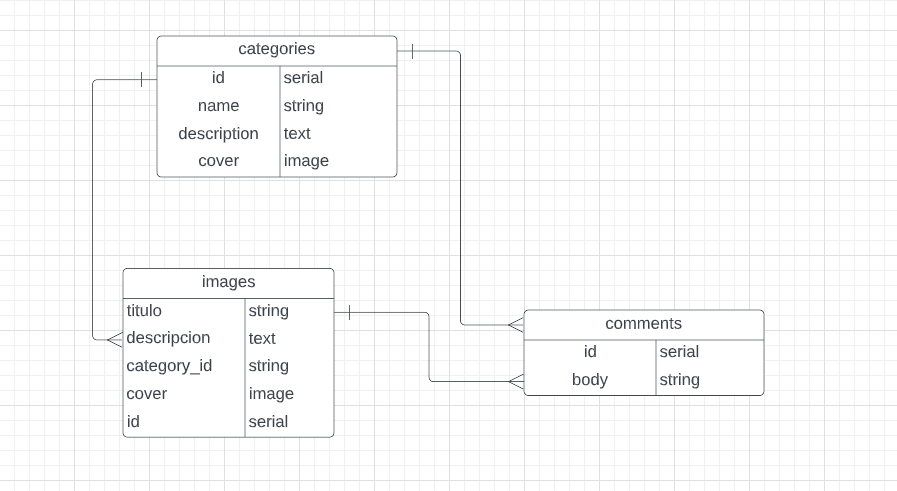

# SOMESPLASH

Welcome aboard fellow developer, this project is about  an open source platforms to share amazing photos with the world.

This project was built only with the design of the main views [here](https://www.figma.com/file/UqSMl0f43mV6yqguK6IrVR/Somesplash?node-id=888%3A708). My Team and me had to infer many details based on the design to develop this design. 

 ## Project's Erd
   This is the ERD that we achieved to build with the design in Figma and infering many details.

### Erd Somesplash



## Installation

For this project I used [rbenv](https://github.com/rbenv/rbenv) to manage gems..

#### 1. Clone or download this project
```bash
git clone git@github.com:Camilo-J/SomesPlash.git
```

#### 2. Install all the project's gems
```ruby
bundle install
```

#### 3. Create the database for the project
```ruby
rails db:create
```

#### 4. Execute all the migrations
```ruby
rails db:migrate
```

#### 5. Raise the server.That's all, Enjoy the project!! :)
```ruby
rails s
```


## Author
| SR No | Author  |
|-------|---------------------------------------------------------------------------------------------------------------------------------------------------|
| 1     | [Elias Mesones](https://github.com/eliasmaq)                  |
| 2     | [Diego Miñano](https://github.com/minanodiego)              |
| 3     | [Chritian Fita](https://github.com/Christian-Fita)                  |
| 4     | [Camilo Huanca](https://github.com/Camilo-J)                  |

## Helpful Links

* [Version Control](https://en.wikipedia.org/wiki/Version_control)
* [HTML](https://developer.mozilla.org/en-US/docs/Web/HTML)
* [CSS](https://developer.mozilla.org/en-US/docs/Web/CSS)
* [Figma](https://www.figma.com/)
* [Rails Guide](https://guides.rubyonrails.org/)
